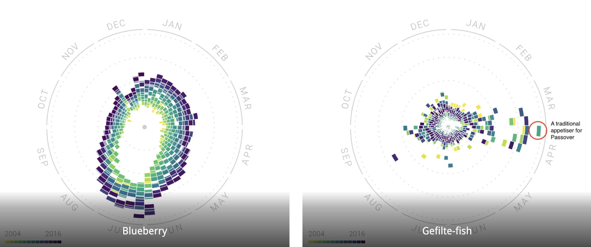

<blockquote class = "origin"> 
This post is orginally post on <a herf="https://hh2022.amason.sites.carleton.edu/week-2/analysis-of-the-rhythm-of-food/">Wordpres</a>
</blockquote>

[The Rhythm of Food](http://rhythm-of-food.net/) explores the trend of different food in the United States in all 12 months from 2004 to 2018 by [Google News Lab](http://newslab.withgoogle.com/) and [Truth & Beauty](https://truth-and-beauty.net/).

## Breaking Down the Project

<em><b>Sources:</b></em> The data is from [Google Trends](http://trends.google.com/trends/) data for hundreds of dishes and ingredients in the United States over 15 years, from 2004 to 20018. It comprises 201 topics and presents 155,705 individual data points.

<em><b>Processes:</b></em> All the data points are organized into 12 months. Referenced from the [FooDB](http://foodb.ca/), data are then separated by hundreds of ingredients, recipes, and other food-related search terms.

<em><b>Presentation:</b></em> They plot the result in a year clock graph with a unique color representing each year.

## Goal & Target Audience of the Project

The goal of this project is to show a clear demonstration of how the trend for a certain food evolved from 2004 to 2018. It also investigates how the trend can be influenced by months. For example, fruits would be more popular during their natural seasons, or some foods are more popular on holidays. (see Fig 1)

<em>Fig 1</em>

Thus we can say that the target audience for this project can be the market director of a food company. The project can present a clear view of what is the current trending food or ingredients in the market, thus helping the company to determine what to launch next. Moreover, for a certain product, this project can demonstrate in which month is such product most popular. In this way, the company can determine the release date or when to start a mass campaign for this product based on the year clock graph.

## A New Question to Ask

A new question to ask is How to apply this graph in a more detailed way? The project only investigates the data points in the United States. Is it possible to investigate the trend for different states? In this way, we will have the chance to see what is the preferences of food for a specific state and how this trend changes over the years. In addition, can the project view the whole world’s data to find out what is general trends for food over the years? For example, do people prefers more healthy food than 10 years ago or not?
