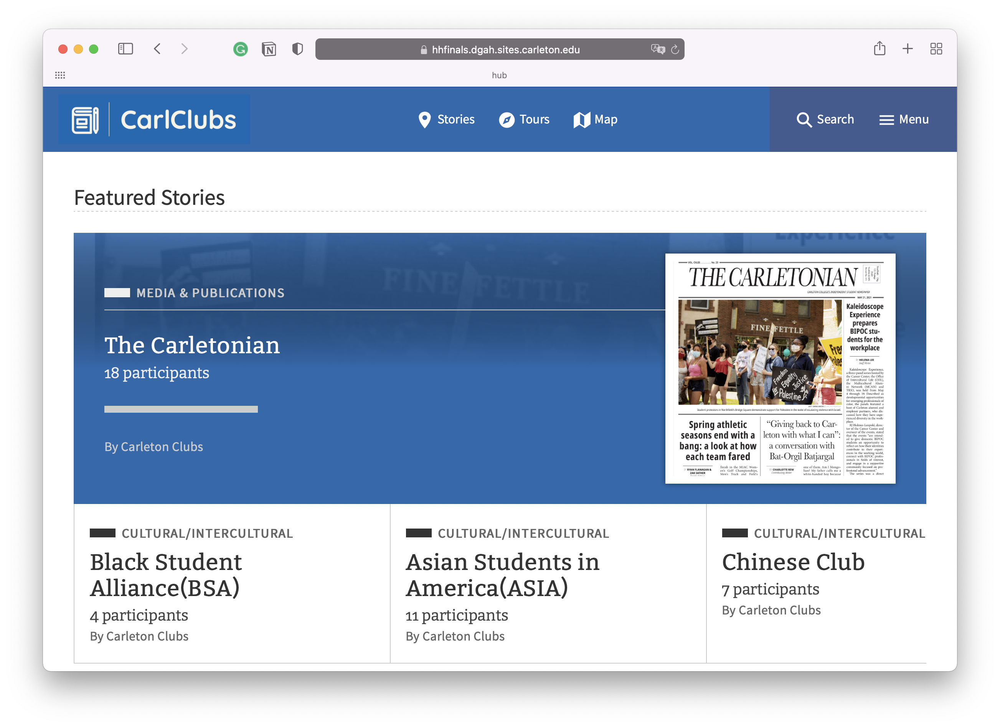
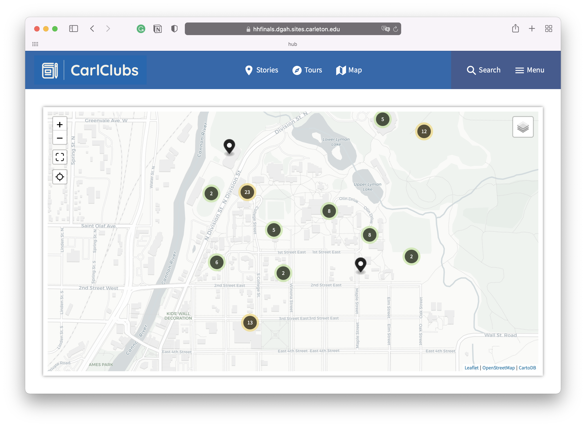
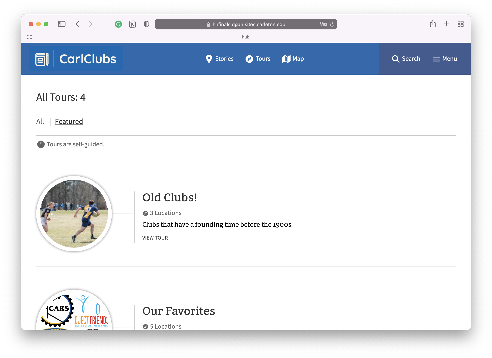
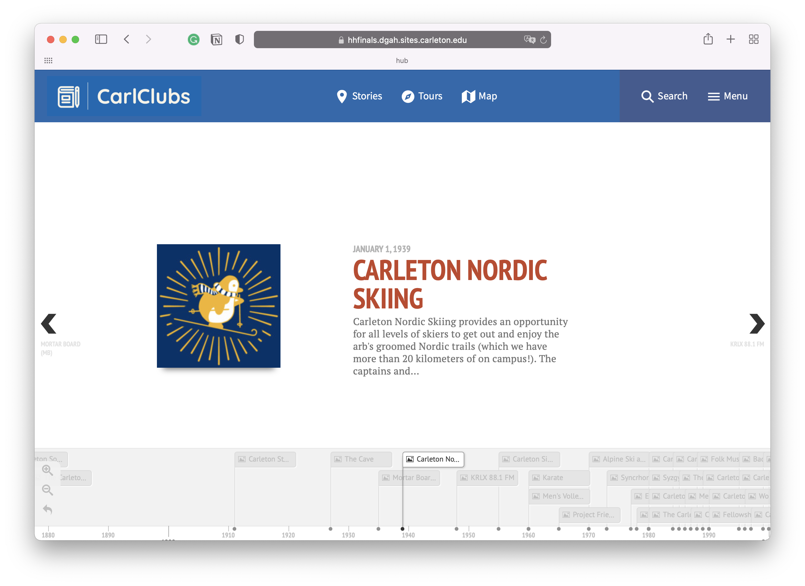

This is CarlClub, a collaborative project for DGAH 110: Hacking the Humanities final. It is co-created by Kevin Chen, Carlos Flores, Adam Kamp, and James Marlin.

## What is it about?

It is a website dedicated to the history and current state of clubs at Carleton. It intertwines both the history of former clubs and greater student entertainment and the full roster and info of currently operating Carleton clubs. Some of the main features of the project include:

- An interactive map where users can interact with various clubs by clicking on them on the map,
- A timeline where users can see the history of clubs that have existed for a while
- A section dedicated to “tours”, where users can view several categories of clubs that we find interesting or enlightening.

Our project has information on 140 clubs, 93 of them have location information, and 94 of them present us with the founding time.

## A Detailed explanation of the website's functionality

<em>Map for the clubs</em>

In the map section, there is a map where each pin represents a club. If you zoom out, it will also show you how many clubs are in that region. Moreover, if you click on a pin, it will prompt a card view of that club with its name, club image, and location name.

<em>Tour Section</em>

In the tour section, we listed some of the clubs that have a similar category. For example, one tour contains clubs that dated back to the 1900s. We also document clubs based on our group's interests. Inside each individual tour, you can see a short description we wrote for this club as well as a link to the club listed. You can also view the location of these clubs. There is a map function embedded in the tour that only shows the location of the clubs inside the tour.

<em>Timeline of the clubs</em>

Here is the timeline for all the clubs. You can see there is an image as well as a short description of the club. If you want more details, you can click on the title of the club, which will direct you to that club's page. The page for the timeline is a bit difficult to find, you need to go to the menu on the right and there is a `club timeline` there.

## Tools used

The project is created through Omeka using the [Curatescape](https://curatescape.org) plugin in that such plugin helps us create the interactive map for the clubs. To import the data, we first create a `.csv` file with the details of the clubs using this [website](https://carleton.presence.io/organizations). Then we use the Omeka CSV Import+ plugin to parse all the data in the file into an Omeka item. A detailed tutorial can be found [here](/blog/omeka-csv-import+-tutorial).

## My Motivation

I always love the many options that Carleton provides in terms of entertainment. But every piece of information is scattered across the campus thus it is not always ideal to get a full picture of all the great activities that Carleton provides. Using an interactive map, students like me can better understand what is offered across the campus. Moreover, I also want to learn more about clubs and activities’ history and display it on the map. Thus, if someone wants to join a club, they can have a better sense of what the club is offering throughout the time.

I think this project is a great way for new students or prospective students to learn more about Carleton and can better attack more students. I believe this project can shed light on all the cool and interesting entertainment that Carleton has.
