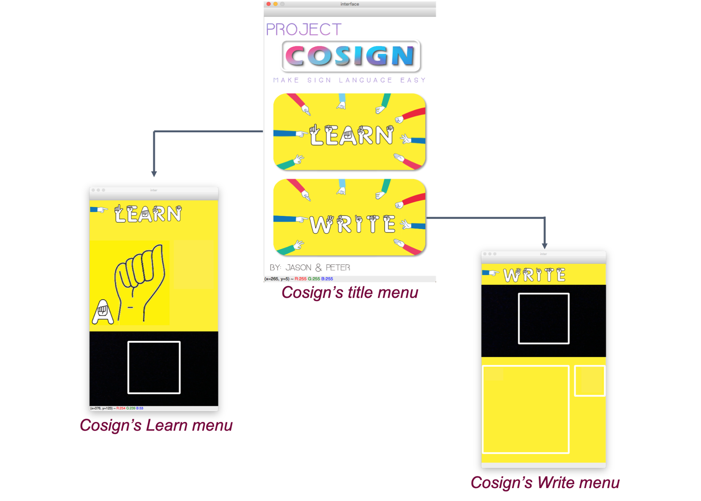

<blockquote class = "origin"> <p>This project is guided under Professor <a href = "https://sites.google.com/macalester.edu/susan-fox-profile/home">Susan Fox</a> from Macalester College and RA <a href = "https://mash.studio/">Mash Ibtesum</a> from Caleton College. Cocreated with <a href = "https://www.linkedin.com/in/jason-barnett2/">Jason Barnett</a>.</p></blockquote>

Cosign is an American Sign Language app developed by `OpenCV` and `TensorFlow`. It can recognize the live video feed of the user’s American Sign Language (ASL) gestures and convert them into individual letters of the English alphabet. Cosign also allows users to spell out full words and sentences letter by letter through sign language. This project is developed under the guidance of the Summer Liberal Art Institute at Carleton over the course of 2 weeks.

## Features



<p class="figure-caption"><em>Interface for Cosign</em></p>

Cosign features two different modes: the “learn” mode allows users to practice their sign language skills and the “write” mode gives the ability to create words or full sentences through ASL gestures. Write mode also has an autocorrect feature.[^1] However, there is a prerequisite for using Cosign: make sure there is a **simple background** behind your hand to prevent inaccuracies.

## Detection Process

Cosign uses a convolution neural network to detect the user's hand gesture and return the corresponding letter. It can predict 29 different outcomes, which are:

- 26 alphabet letters
- Delete
- Space
- Nothing (no outputs)

Moreover, to increase the training accuracy while maintaining a reasonable amount of training time, we use transfer learning based on the pre-trained `VGG-16` network and add 2 more layers and a final output layer.

### Dataset

To train the model, we use the kaggle ASL [Alphabet Dataset](https://www.kaggle.com/datasets/grassknoted/asl-alphabet) with 29 folders each representing an alphabet (and space, delete, nothing). It has an overall 87000 images with a dimension `(200,200,3)`.

### Preprocessing

To reduce the possible over-fitting of the model, we first randomly separate the train data into `train set` and `validation set` (the top 5000 data points are used for validation). Then to reduce the computation complexity, we reduce the size of input image from `(200, 200, 3)` to `(100, 100, 3)`. We also normalize all the data into a floating point between 0 and 1.0.

At last, we perform a one-hot encoding for all the labels.

### Model Architect

Initially, we try to create our own model from scratch and decide all the parameters by ourselves. However, by multiple trials, the result is not very promising while causing us too much training time. Therefore, we decide to try transfer learning on `VGG-16` (a pretrained 16 layers deep convolutional neural network).

Therefore, we first import the VGG-16 base and change its input size to `(100, 100, 3)`

```python
vgg_base = keras.applications.VGG16(weights = "imagenet",
                                    include_top = False,
                                    input_shape=(100,100,3))
```

We also make each layer in `vgg_base` is non-trainable. Building from the `vgg_base`, the complete model architect is as follows:

```python
model = Sequential([
  vgg_base,
  # First self-add layer
  Flatten(),
  Dense(8192, activation = "relu"),
  Dropout(0.8),
  # Second self-add layer
  Dense(4096, activation = "relu"),
  Dropout(0.5),
  # Output layer
  Dense(29, activation = "softmax")
  ])
```

Last but not least, we compile the model using the Stochastic gradient descent with a 0.001 learning rate and the categorical cross-entropy loss function. Then, we fit the model for 10 epochs with 32 as its batch size.

```python
model.complie(optimizer = keras.optimizers.SGD(lr=0.001),
              loss = keras.losses.CategoricalCrossentropy(),
              metrics=["accuracy"])
```

Since the training time is relatively long, we usually leave the model to train overnight. Therefore, to avoid any possible data loss, we create a checkpoint after each epoch. In this way, if one training is interrupted for some reason, we can still quickly recover it.

## Demo Video

`video: https://www.youtube.com/embed/j9-UWK7xyhU`

## Limitation

Since we only work on this project for 2 weeks without any prior experience in machine learning, there are still many future improvements.

- Model cannot perform very well with a clean background
  - Perform a counter-finding of the hand before feeding it into the model
- Model's accuracy still needs improvement
  - Can change the optimizer into `Adam`
  - Use `from_logits=True` in the loss function to reduce round-off error
- The app runs on `OpenCV`, which is not accessible
  - Implement a mobile app version of Cosign

[^1]: http://norvig.com/spell-correct.html
