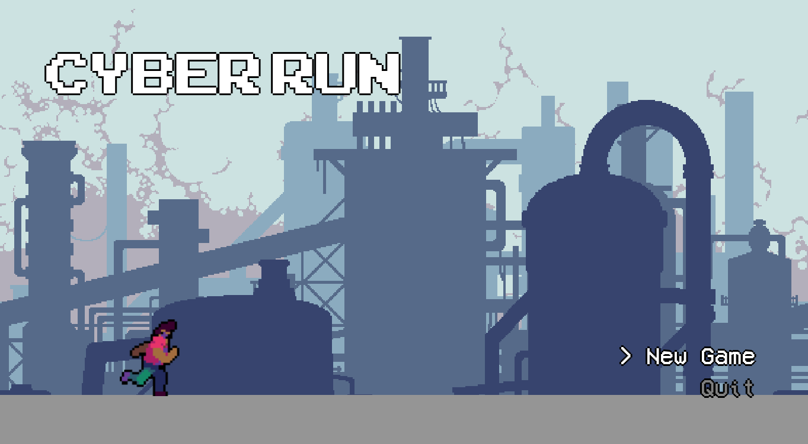
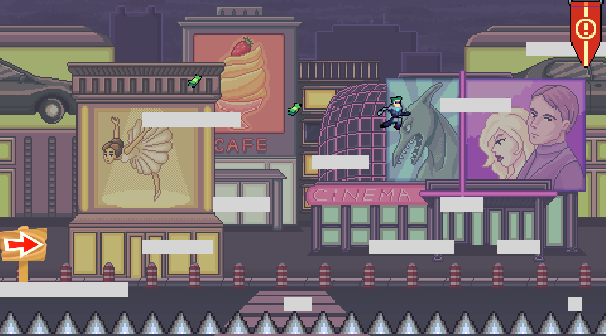

## Introduction of the Game

This is the game I made for my CAMS 275: Video Games and Identity class's final project. Here is the [link](https://gxc.gg/games/8rd3si/cyber-run/) for the game. I want to use the gameplay logic to evoke critical thinking from the player. Therefore the game is designed to be **hard**. The game looks like a simple platform game, yet when you play it, you will find out there are more elements underlying a simple platformer logic.

## How to play it

To play this game, you need to install Opera GX, which will be prompted when you open the link. I only upload this game to a platform called _GXC_ (an online game platform developed by Game Maker Studio and Opera) because I use game maker studio to create this game and _GXC_ is the only platform I can upload for free.

This game has fairly easy control.

- _A/D or left/right arrow key_ --> move forward or backward
- _space bar_ --> jump

There is an ugly bug in this game that might cause you to get stuck in the wall. I think it has something to do with the hitbox of some game sprites. When you face such an issue, **press c to escape**.

## Game Mechanics

The game looks like a platformer with a timer. So the most basic goal is to reach the flag as quickly as possible.

The game is structured as a fake multiplayer game with 4 characters all having **different** jump heights and run speeds. The one who first touches the flag at the top-right corner of the screen wins. Character 1 has the worst stat and character 4 has the best one. Players get to experience different characters in 4 rooms, with room 1 corresponding to character 1 and room 4 to character 4. Each room also has a different difficulty level. Room 1 is full of spikes and deliberately placed walls while room 4 is only a straight path of platforms with no spikes.

Moreover, the game requires the player to **lose**. When first entering the game, players have to play the first room and act as character 1. The other characters in the room create a disturbing atmosphere since they can run faster and jump higher than the player. As a result, players need to finish this highly demanding room with a lot of stress, creating an extra burden for them to succeed in this game.

In addition, there are also collectibles placed in each room. Each collectible can increase the player’s jump height and run speed by 10%, which also acts as a way to illustrate the room’s difficulty level. Collectibles in rooms 1 and 2 are placed in extra dangerous locations with spikes around them while in rooms 3 and 4, collectibles are placed just in the player’s path to the flag.

> **SPOILER ALERT!!** If you don't want to know what the game is about, play it first and then see whether you idea matches my intentions!

## What is the game trying to tell you

Click to reveal!

The game is about unfairness in society with three layers of messages to communicate with the players. The game introduces the presence of unfairness and also illustrates some of its potential causes through the game mechanics and representational elements. It also comments on society’s neglect of unfairness.

### How does the game show that?

Since the game is structured as a multiplayer game, the normal expectation for this game is that all characters compete at the same level. The mechanics here revert the players’ expectations, forcing them to play the game with a biased character design.

Connecting the idea of “you never win games” discussed by Mary Flanagan, such a gaming experience alienates players from the game objective, allowing players to think seriously about the underlying reason why they are not winning this game. [^1] The players will then have the chance to realize that the difference in characters’ stat is a manifestation of the unfairness in society.

The game also comments on the phenomenon that society nearly neglects the presence of unfairness. There is a common misconception that efforts and hard work are the sole contributing factor to success. When a person succeeds in a certain field, the most predominant perceived cause is the large amount of effort he/she puts in for that accomplishment. The game follows this logic that all the successes are effort-based.

Whenever a player finishes a room, either wins or losses, the player would be
directed into a new room. 3 possible situations may arise.

- If the player finishes first in the previous room, he/she would be prompted by how many milliseconds took to succeed and be praised for the hard work. Milliseconds here serve as a way to highlight and exaggerate players’ efforts.
- If the player reaches the flag but doesn’t come in first
- Or the player is killed by the spikes, he/she would be informed by all the other player’s finished time and the overall ranking. And the game deliberately mocks the player for failing at such a “simple” game and pushes them for extra effort.

However, the real situation is that players are more likely to finish first in room 3 or 4, which are much easier and would take less time to conquer. Therefore, when finally finished first in a room, all the amount of effort that the game praises are **less than the actual efforts that the player devotes**. It is possible that the player spent more time and effort in room 1 or 2 but couldn’t succeed while easily finishing first in room 3 or 4 with less effort. How the game counts such efforts as the only cause of success is similar to how society views the relationship between success and efforts. The player can then discover an unequal relationship between the recognized and praised efforts and the actual efforts devoted. Using the concepts of cultural capital, the embodied state such as family background, gender, race, or socioeconomic level, also contributes to people’s accomplishments. [^2] Since embodied cultural capital is something that resides within us, it is often invisible to the general public and overlooked by its effect on an individual. The endgame screen reveals how embodied cultural capital serves to assist people by showing the unbalance of socially recognized efforts and the actual effort, illustrating how society’s view on success is misleading and flawed.

[^1]: https://doi.org/10.7551/mitpress/7678.003.0008. Flanagan, Mary. “Critical Computer Games.” Critical Play, 2009
[^2]: https://doi.org/10.4324/9780429494338-6. Bourdieu, Pierre. “The Forms of Capital.” The Sociology of Economic Life, 2018, pp. 78–92.

 

## Reflection

From multiple rounds of testing by peers, the game also presents some limitations.

- As a platformer, the game doesn’t have a smooth control in that the initial run speed and jump height for each character is not being carefully designed.
- The collectibles in the game are designed as money, which also cannot best contextualize the extra efforts devoted by an individual.
- The room design can also change to illustrate a more reasonable difficulty curve.

In addition, the game can better utilize the anger that players get from playing. With **59,360** lunches, the game only receives a rating of 1.67 out of 5 and keeps decreasing, which is an indication that people dislike this game and triggers their anger. The game can utilize this anger to better state the issue of unfairness by transforming it into an actual multiplayer game. In this way, players can directly understand the idea of unfairness since their opponents all have different player stats. Moreover, a multiple-player game emphasizes the idea of competition, which exaggerates the idea of failure presented in this game and better illustrates the idea of “you never win games” discussed in the theoretical basis section.
