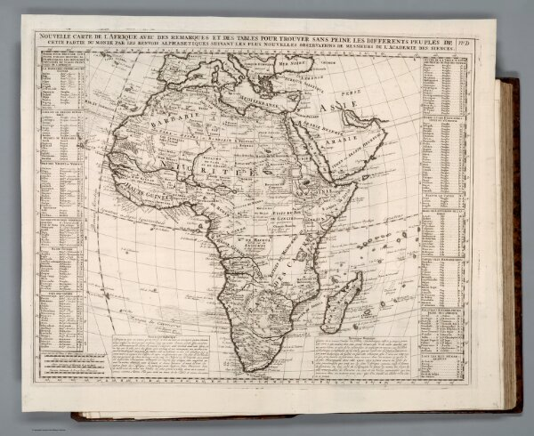

<em>Map Of Africa in 1720</em>

I highly enjoy the process of georeferencing. And here is my [result](https://davidrumsey.georeferencer.com/maps/f5cac6c5-f344-4c6f-9fc0-eceafea86174/). I did a map of Africa which was published in 1720. I am shocked at how powerful [David Rumsey Georeferencer](http://www.davidrumsey.com/view/georeferencer) is. I used to think when doing georeferencing, you need to make sure the contour of the old map matches exactly the same as the real-life map by inserting a large number of points. But the website allows me to insert a minimum of 5 points and it can conjecture how the historical maps can align with the real-life map. This can be a large increase in efficiency and also lower the threshold for georeferencing.

With this georectified map, I think we can have a better understanding of how mapping technology has increased over the years. The compare tool allows me to spot any inconsistencies between the historical maps and the current map. We can see clearly that some borders are not very precise and lack details, which can be an indication of the poor mapping technology in 1720.

The website allows me to export the result to GeoTIFF. It can also generate links for Web Map Tile Service, TileJSON, and XYZ. During georeferencing, I think we need to care more about the shape of the historical map. Some historical maps are drawn in spherical coordinates or viewed at the top of the earth, which cannot be directly converted into the website template. So we need to consider whether our historical maps are applicable for georeferencing on this website. Although georeferencing is a power tool, it doesn’t record the altitude data. Thus, if we want to investigate how different landscapes affect the Gettysburg battlefield, georeferencing might not be the best solution.
