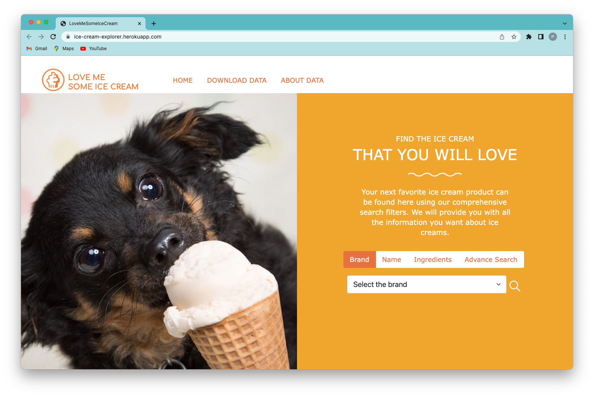
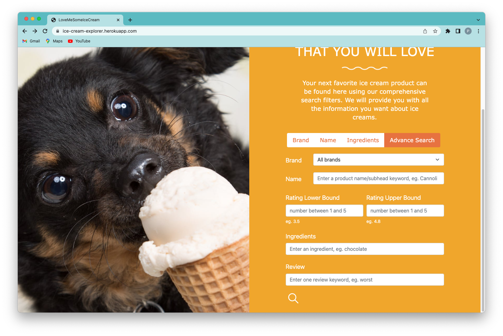
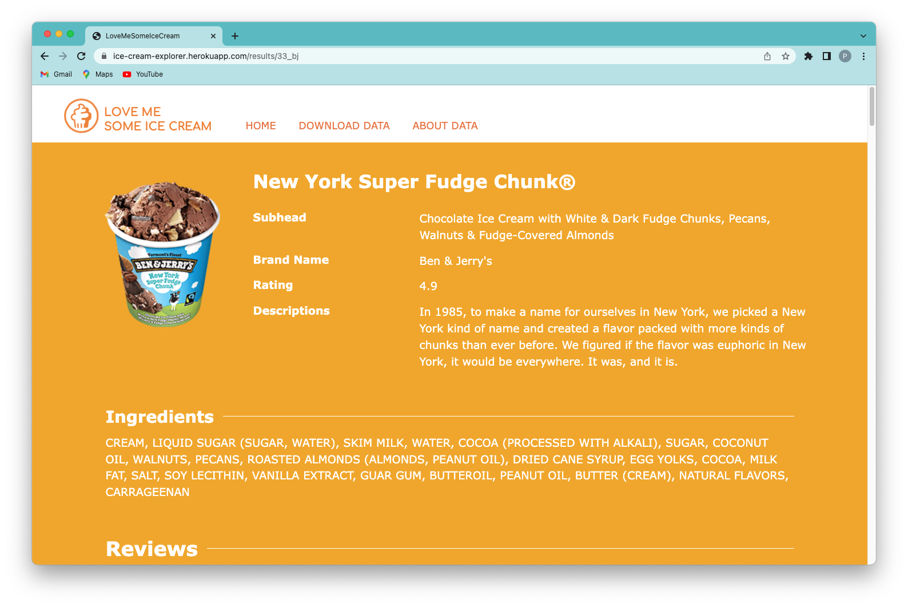

<em>Front page of the website</em>

This website allows ice cream lovers and customers to explore information, such as ratings, reviews, and ingredients, for various ice cream flavors from four popular brands. It can base on the user's input to query the database using pure SQL. This website is built by Flask with the help of bootstrap in the front end. This project collaborates with [Helen Du](https://github.com/helenduz) & [Yucheng Yang](https://github.com/YuchengY). Here is the [Github](https://github.com/tutingjun/LoveMeSomeIceCream) link for the source code.

## Functionality

### Front Page

On the front page, users can choose to search for ice cream either based on brand, name, or ingredients. If they want a more comprehensive search, they can choose the _Advance Search_ tab and input whatever value they want. If a field is not filed, the website will automatically choose the default value to ignore this field.

<em>Advance Search</em>

### Result Page

On the result page, users can select an ice cream to see its detailed information, including but not limited to rating, descriptions, ingredients, and reviews.

<em>One of my favourite ice creams</em>

Moreover, users can also sort all the ice cream results by alphabetic order, average ratings, and number of ratings.

### Additional Functions

In addtion to searching ice cream data, users can also download the dataset, in `.csv` format. They can choose to download either the entire dataset or the specific brand dataset. Moreover, they can also view our metadata information and source of data in order to make everything transparent.

## About Data

The dataset used in this website is called _Ice Cream Dataset (Version 3)_ from [Kaggle](https://www.kaggle.com/tysonpo/ice-cream-dataset) by Tyson Pond. It contains detail, images, and reviews of 241 ice cream flavors across 4 brands (Ben & Jerry's, Häagen-Dazs, Breyers, and Talenti). All datasets provided are in .csv format, and the images provided are all png formats. The full dataset consists of 5 folders: bj, breyers, hd, talenti, and combined, which represents the four ice cream brand names and a combined folder. Each folder contains three files: `images folder`, `products.csv`, `reviews.csv`.

## Reflection

This is our group's first ever developed website with interactions with the database and front end. We built this website in 7 weeks while learning different techniques for web development, product life cycle, and how to write readable codes. I believe the most painful part of the development of this website is writing and learning `css` and `html` from scratch and mainly based on materials scattered around the internet.

However, since it is our first website, there are still many improvements, such as: adding a footer, cleaning up the navigation bar, and modifying the layout of the result page. In addition, there is also a bug in our website, that is: using the browser back button when returning from `product_list(product_list.html`)` to the home page(index.html) and hitting the search button again will return all products (the search filter will not work even though the conditions put in before will be there).

Nevertheless, this project presents me with the opportunity to take a peek at what web development is like and gets me on the hook for the idea of full-stack development in the future.
