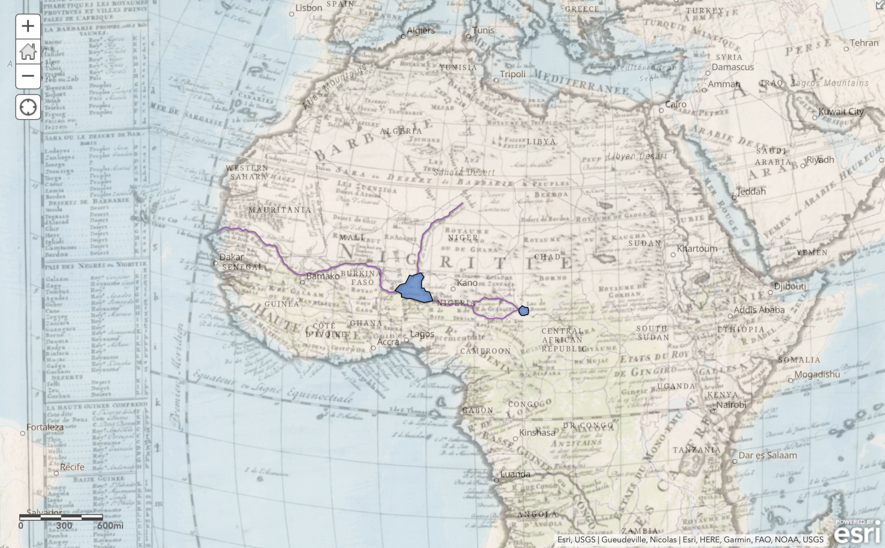

<blockquote class = "origin"> 
This post is orginally post on <a herf="https://hh2022.amason.sites.carleton.edu/week-5-3d/my-experience-with-web-mapping/">Wordpres</a>
</blockquote>

<em>Result of Digitizing Features for the Georeferenced Map</em>

I have a lot of fun adding lines and areas to my map and comparing it to the actual world map. I am surprised to see how the rivers and lakes marked in 1720 disappear on the current map. It definitely shows how the geographic feature of Africa has shifted over the 300 years.

And this is the map describing the squirrels in Central Park, Manhattan. I also incorporate the New York subway data and safe street for senior data because I think it is interesting to see how one map can represent so much data.

<iframe src="https://carleton.maps.arcgis.com/apps/instant/imageryviewer/index.html?appid=1adc6a64379a4459a8319707f77ee036" width="600" height="450" frameborder="0" style="border:0; margin-bottom: 0.5rem;" allowfullscreen="">iFrames are not supported on this page.</iframe>

For the squirrel data, I add the NYC subway data and the safe street for senior data. When I am browsing through ArcGIS Online, I am excited to see how different data can coexist on the same map and show different information. With the right dataset, I believe it is a great tool to find any correlations between different datasets and I am looking forward to exploring this in my project later.
