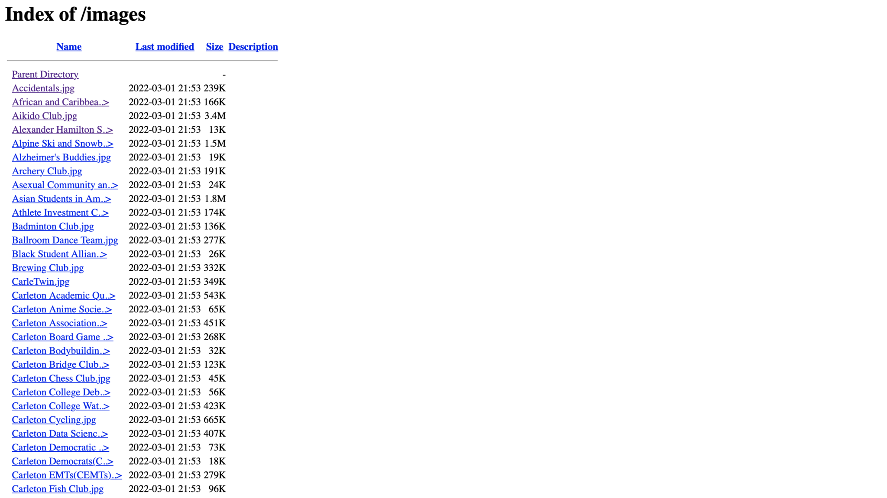
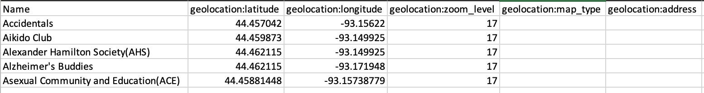
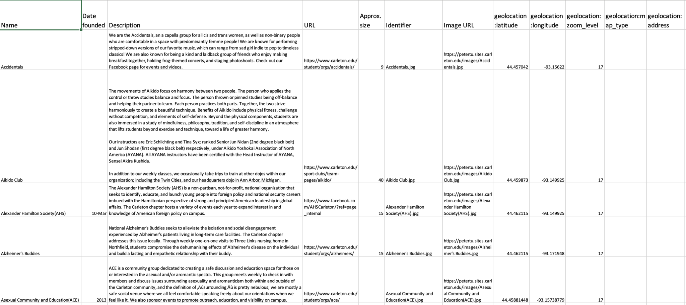
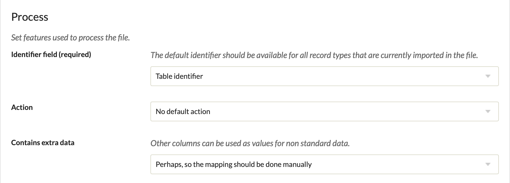
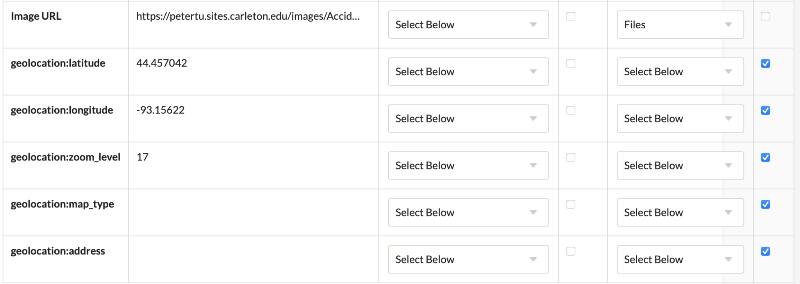

<blockquote class = "origin"> 
This post is orginally post on <a herf="https://hh2022.amason.sites.carleton.edu/week-9-project-preparation/omeka-csv-import-tutorial/">Wordpres</a>
</blockquote>

Omeka is a content management system and web publishing platform designed specifically for Digital Humanities, which can store and organize metadata. This platform is mainly used for building collections of a set of data and then organized into different categories. Most of the time, the size of data might be too large thus it is not reasonable to manually input those data into Omeka. Importing all the data using a CSV file might be a better approach. This tutorial will introduce a plugin in Omeka called CVS import+, which allows the user to import items from a CSV file. More importantly, this plugin can also convert certain data entries into files or geolocation, which can further facilitate the process of creating items in Omeka.

- **Prepare your file links**

<em>Screenshot of my cPanel with each club’s photo</em>

To import files, make sure all of the files are stored on a server instead of your local computer. In this way, each file can be found using a unique URL and CVS import+ will automatically download the file from the URL and add it to each item. You can upload the files on your personal cPanel host. Make sure to go to the public-html directory and then upload, otherwise your files are not visible to the public. Once you finish uploading, you can then access each file at URL: `https://your-site-name/folder-name/file-name`. For example, if I want to find the picture called “Accidentals.jpg” on the above screenshot, I can simply type https://petertu.sites.carleton.edu/images/Accidentals.jpg into my browser.

- **Prepare your geolocation data**

<em>Screenshot of my example CVS file with geolocation information</em>

CSV import+ can magically import location data if you have the right data type. To begin with, make sure your Omeka site has installed the [Geolocation](https://omeka.org/classic/docs/Plugins/Geolocation/) plugin. This is the one responsible for recording and displaying the location data in the Omeka. Then you need to get the exact coordinate of the location you want to import. The above example shows these 5 clubs’ meeting locations. Noted that each location is stored with 5 different columns: geolocation:latitude, geolocation:longitude, geolocation:zoom_level, geolocation:map_type, and geolocation:address. The first two columns are the latitude and longitude of the location and the third column is the zoom_level of your map when you are displaying the location. For the last two columns, we can simply leave it blank as the first 3 columns are all we need to record location data.

- **Create your CSV file**

<em>Screenshot of the example CSV</em>

With the file data and geolocation data, now is the time to finally create your CSV file. Make sure the column name of the geolocation data is exactly the same as the previous step and all the file URLs can direct into the file in your host. You also need to have a column that every element in it is unique to act as the identifier for each item. Here I use my image file name as my identifier. Moreover, there can be empty cells in your CSV file but make sure there isn’t any empty row.

- **Upload the file into the Omeka**

<em>Import settings</em>

With our CSV file ready, we can upload it to the Omeka site. To avoid any wicked problems that may occur during the import, just follow the import settings on the screenshot above and leave any other field as the default setting. Then click the _next_ button.

- **Map all the columns**

<em>Setting for mapping file and geolocation columns</em>

Once you hit next, Omeka will direct you to a new page that requires you to map columns to different elements in Omeka. You can select the element that best fit your data. But for the column storing the file URL, make sure to select **Files** on the special value tabs. And for all 5 columns describing the geolocation data, make sure to tick the **extra data?** box. You also need to choose an **identifier** on the special value tabs for the column that represents the element’s identifier.

Following all 5 steps, you successfully import the files and geolocation data into Omeka using CSV import+. For more information, you can visit these links below:

- [Omeka user manual](https://omeka.org/classic/docs/)
- [Documents for Geolocation plugin](https://omeka.org/classic/docs/Plugins/Geolocation/#geolocation)
