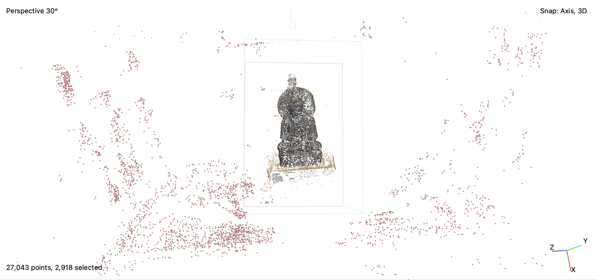
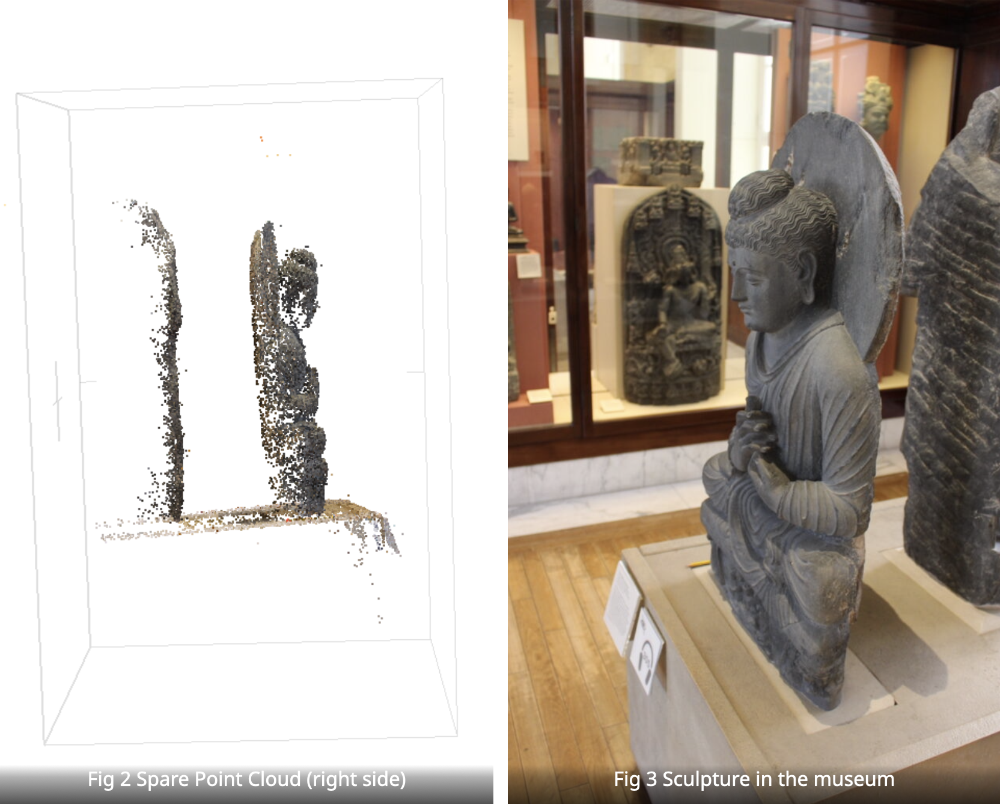
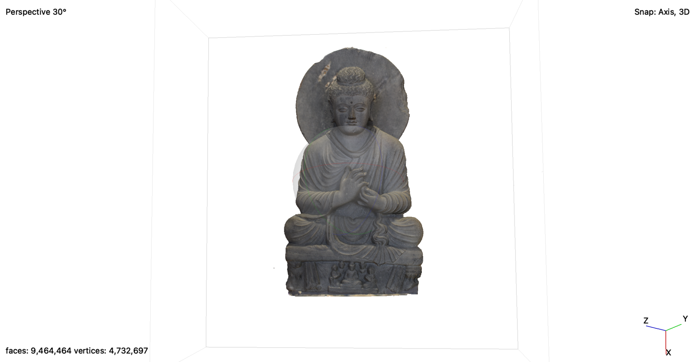

<blockquote class = "origin"> 
This post is orginally post on <a href="http://midterm.petertu.sites.carleton.edu">Wordpres</a>
</blockquote>

 <iframe width="100%" height="400" title="Peter Tu Midterm Photogrammetry Result" frameborder="0" allowfullscreen="" mozallowfullscreen="true" webkitallowfullscreen="true" allow="autoplay; fullscreen; xr-spatial-tracking" xr-spatial-tracking="" execution-while-out-of-viewport="" execution-while-not-rendered="" web-share="" src="https://sketchfab.com/models/52ae06a6ad09491d94dfec594b486f3f/embed"> </iframe> 

This is my result of using photogrammetry to model the Buddha Preaching in British Museums. The photographs and masks are created by Daniel Pett (dpett@britishmuseum.org) and the whole dataset can be found on [Github](https://github.com/BritishMuseumDH/buddhaPreaching).

To build this model, I used [Metashape](https://www.agisoft.com/downloads/installer/), which is a leading photogrammetry software, and enroll in the 30-day free trials in order to share my model. First of all, I import all the photos and masks from the dataset. Then I align them to create a spare point cloud, which looks like this:

<em>Fig 1. Spare Point Cloud without displaying the cameras</em>

We can see that there are a lot of redundant points in the spare point cloud so I delete those. Moreover, on the back of the model, there are points mapped to the other Buddha Sculptures on the back and I also delete them in order to get an accurate Spare Point Cloud just for the one I need to model.

<em>Spare Cloud VS. Actual sculpture</em>

Thus by doing some points cleaning, I manage to get a clean spare point cloud describing only the sculpture I want to model. With this clean point cloud, I proceed to the next step where I build the dense cloud and mesh. In order to obtain maximum accuracy, I choose ultra-high quality to build the dense cloud, which causes me about 6 hours to finish. Last but not least, I build the texture of the model with the information obtained from the photosets.

<em>Fig 4 Model generated by photogrammetry</em>

To present the model, I try to upload it on Sketchfab. Yet the export file is more than 700 MB, which exceeds the maximum file size by Sketchfab. By consulting Austin, he showed me a tutorial on how to [decimate the mesh](https://www.youtube.com/watch?v=uaw9oJYRpGY), which successfully reduced the file size to 15 MB without a huge loss of quality. By uploading the model to Sketchfab, I get the opportunity to share my result with different people and allow them to play with it. They can see different dents and scratches on the sculpture and have a more concrete idea of how long this sculpture lasted. Yet photogrammetry still has its flaw. Since the software only creates a model using 46 images, there are some areas where the software cannot create meshes, such as the areas behind the ears, or the backward of the model.

Nevertheless, photogrammetry is an excellent tool in terms of creating accurate models and allowing producing models more accessible. Before we need to spend hours creating each polygon to get an accurate model. Now with photogrammetry, we only need to take pictures from different angles and enjoy different algorithms doing their magic. People that don’t have a background in making 3D models can have the opportunity to present accurate, detail-focused models without spending hours figuring out how different modeling software work. Thus, I believe that this digital approach will effectively make 3D modeling more accessible to the public.
