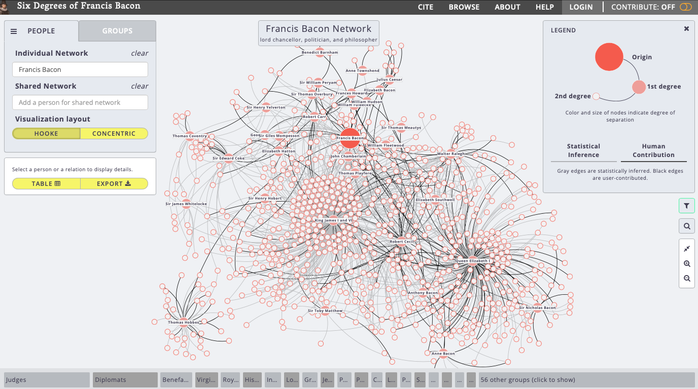

<blockquote class = "origin"> 
This post is orginally post on <a href="https://hh2022.amason.sites.carleton.edu/week-4-spatial-humanities/six-degrees-of-francis-bacon-2/">Wordpres</a>
</blockquote>

This is a network analysis of [Six Degrees of Francis Bacon](http://www.sixdegreesoffrancisbacon.com/).

## What are the nodes and what are the edges?

The nodes represent people who have some relationship with Francis Bacon. Each edge shows the relationship between two people. A grey edge shows that the relationship is concluded from statistical interference while a black edge represents the relationship recorded by human contribution.

## How are the relationships characterized and categorized?

The relationship (edge) between two people can be explained in two different ways. The first is human contribution. Six Degrees is extensible, collaborative, and interoperable, which means different scholars can contribute to the database. The second is statistical interference, which means the connection is deduced from statistical analysis.

## What interactions does the project allow?

The project allows me to click on the node and edge. Click on each node allows you to see all the edges connected to such a node. You can also see the time period for that person represented in the node and a brief introduction. Click on an edge allows me to see the information for two nodes on each end of the edge and the confidence interval of the connection. Moreover, you can filter the graph by adjusting the confidence level of the connections and the date range of the nodes.
