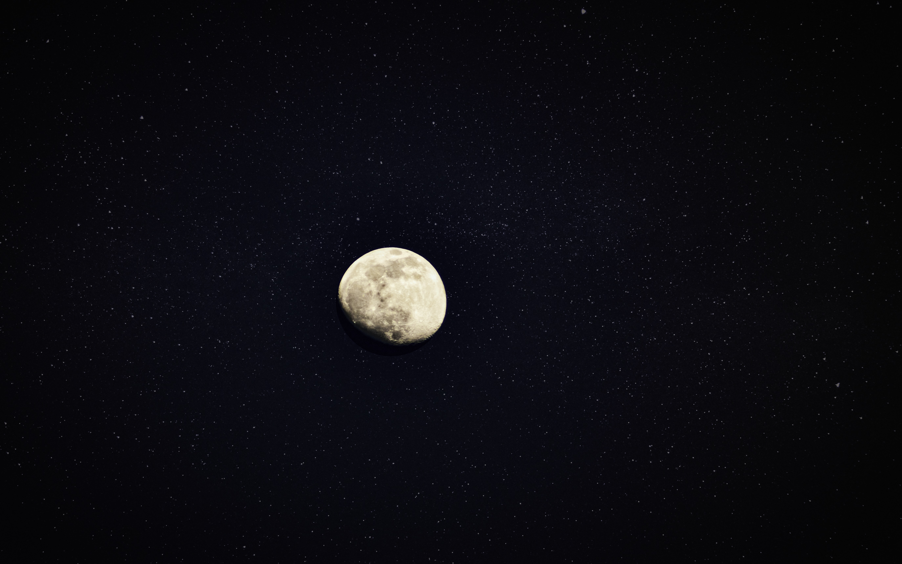

## Image test

## Welcome to my Blog

This is my first blog post! Isn't it _great_? The blogs looks better than I expected. Maybe I need to implement the tags and categories to better make my blog posts. I am kind of unsure what to put in the category and tags since it has literally nothing

## Subsection 1

Some of my **favorite** things are:

- Petting dogs
- Singing
- Eating potato-based foods

## Subsection 2

I have no idea how to formate the blog posts. Now it looks really ugly and I want to make it look good. At least look professional.
